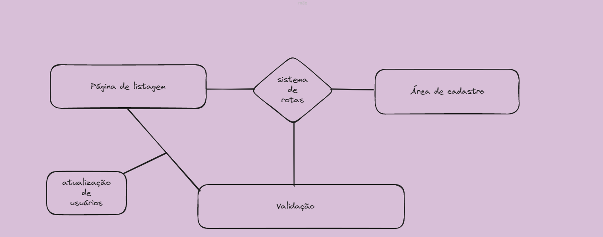
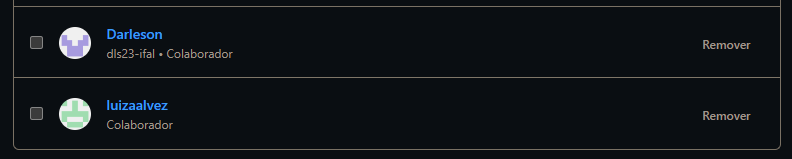

# CRUD---Create-Read-Update-and-Delete- ✨☕💻🖱!!!

Sistema de listagem de usuários validados , utilizando os conhecimentos na área de front-end e back-end . 

### Mapa de funcionamento 

## Colaboradores 🤝🏻

| Função | Nome | Codenome |
|--------|------|----------|
| Coordenador | Leonardo Fernandes | Léo |
| Orientador | Gabriel Rodrigues | Ghost |
| Aluna | Luiza Alves | Lulu |
| Aluno | Darlleson Lessa | DL | 

### Integrantes 

## Anexos 📌

- ### Bootstrap Documention

  https://getbootstrap.com/docs/5.3/getting-started/introduction/

- ### Framework web - express_js

  https://expressjs.com/pt-br/

- ~~Implementação de api~~
  

### Considerações sobre a aplicação desenvolvida. 💭

**Sobre o projeto...**
foi uma jornada desafiadora e enriquecedora para nossa equipe. Distribuímos as responsabilidades entre Darlleson (HTML), Luiza (CSS) e Gabriel auxiliando (back-end), enfrentando dificuldades técnicas ao longo do caminho.Além disso,reconhecemos a importância da validação de dados em aplicações web. No geral, o projeto nos proporcionou crescimento profissional e pessoal, e estamos confiantes de que as lições aprendidas serão aplicadas em futuros projetos.

### Ideia descartada 🗑 

**Decidimos descartar a implementação de uma API para validar o campo de CPF no formulário devido à falta de tempo, desvio da objetividade do projeto e priorização dos recursos para outras funcionalidades mais relevantes.**
